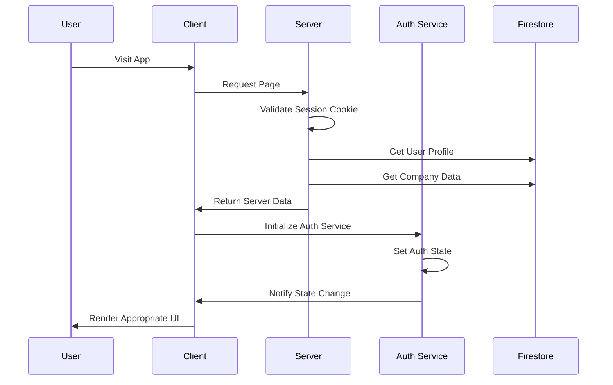
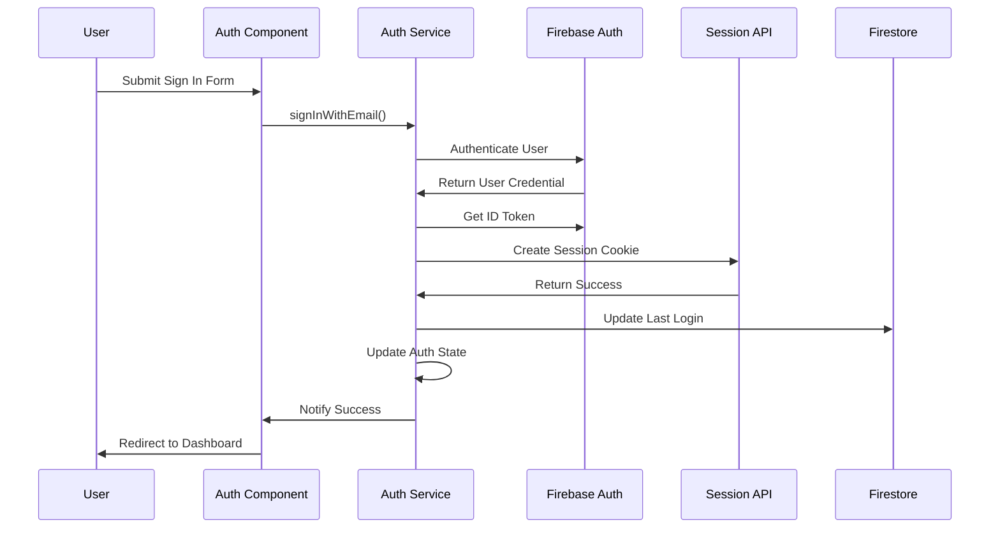

# Unified Authentication Flow - Design Document

## Architectural Overview

This document outlines the design decisions and architectural reasoning for unifying the authentication flow in the TK-Crm application.

## Current Architecture Problems

### 1. Fragmented State Management

The current system has authentication state scattered across multiple stores and services:

```typescript
// Current: Multiple competing states
app.store: { initializing, authenticated, profileReady, companyReady, error }
user.store: { data, loading, error, update }
companyContext.store: { data, loading, error, hasServerData }
```

This creates race conditions where different parts of the app have different views of the authentication state.

### 2. Multiple Initialization Points

Authentication initialization happens in multiple places:

- `src/hooks.ts` - Client-side navigation guards
- `src/lib/services/initService.ts` - App initialization
- `src/routes/(app)/+layout.svelte` - Layout-level initialization
- Individual auth components

### 3. Competing Navigation Guards

Multiple systems try to handle redirects:

- `src/hooks.ts` with `handleNavigate()`
- `src/lib/services/navigationGuard.ts` with `setupNavigationGuards()`
- Layout-level redirect logic
- Component-level navigation

## Proposed Architecture

### Core Design Principle: Single Source of Truth

```typescript
// New: Unified auth state
interface AuthState {
  status: "loading" | "authenticated" | "unauthenticated" | "needs_onboarding";
  user: FirebaseUser | null;
  profile: UserProfile | null;
  company: CompanyContext | null;
  sessionValid: boolean;
  error: string | null;
}
```

### Architectural Layers

```
┌─────────────────────────────────────────────────────────────┐
│                    UI Components Layer                       │
│  ┌─────────────┐  ┌─────────────┐  ┌─────────────────────┐   │
│  │ Auth Pages  │  │ App Layout  │  │ Business Components │   │
│  └─────────────┘  └─────────────┘  └─────────────────────┘   │
└─────────────────────────────────────────────────────────────┘
                              │
┌─────────────────────────────────────────────────────────────┐
│                   State Management Layer                     │
│  ┌─────────────┐  ┌─────────────┐  ┌─────────────────────┐   │
│  │ App Store   │  │ User Store  │  │ Company Store       │   │
│  │ (Simplified)│  │ (Data Only) │  │ (Data Only)         │   │
│  └─────────────┘  └─────────────┘  └─────────────────────┘   │
└─────────────────────────────────────────────────────────────┘
                              │
┌─────────────────────────────────────────────────────────────┐
│                Unified Auth Service Layer                   │
│  ┌─────────────────────────────────────────────────────────┐ │
│  │           Single Auth State & Logic                     │ │
│  │  ┌─────────────┐  ┌─────────────┐  ┌─────────────────┐ │ │
│  │  │ Session Mgmt │  │ Auth Flow   │  │ State Sync      │ │ │
│  │  └─────────────┘  └─────────────┘  └─────────────────┘ │ │
│  └─────────────────────────────────────────────────────────┘ │
└─────────────────────────────────────────────────────────────┘
                              │
┌─────────────────────────────────────────────────────────────┐
│                    Server Layer                             │
│  ┌─────────────┐  ┌─────────────┐  ┌─────────────────────┐   │
│  │ Hooks Server│  │ Session API │  │ Firebase Admin      │   │
│  └─────────────┘  └─────────────┘  └─────────────────────┘   │
└─────────────────────────────────────────────────────────────┘
```

## Key Design Decisions

### 1. Unified Auth Service Pattern

**Decision**: Create a single `UnifiedAuthService` class that manages all authentication state and operations.

**Reasoning**:

- Eliminates race conditions by having one source of truth
- Simplifies debugging by centralizing auth logic
- Provides consistent interfaces for all auth operations
- Enables proper state synchronization between server and client

**Implementation**:

```typescript
export class UnifiedAuthService {
  private state = writable<AuthState>({
    status: "loading",
    user: null,
    profile: null,
    company: null,
    sessionValid: false,
    error: null,
  });

  async initialize(): Promise<void>;
  async signInWithEmail(email: string, password: string): Promise<void>;
  async signInWithGoogle(): Promise<void>;
  async signUp(email: string, password: string, data: any): Promise<void>;
  async signOut(): Promise<void>;
  async refreshSession(): Promise<void>;
}
```

### 2. Server-First Authentication

**Decision**: Server validates session first, then client hydrates state.

**Reasoning**:

- More secure - server validates session before any client code runs
- Prevents flickering by knowing auth state before rendering
- Enables proper SSR for authenticated routes
- Reduces client-side authentication round trips

**Flow**:

```
1. Request → Server validates session → Set locals.user
2. Layout server loads → Validates user profile/company
3. Client receives data → Auth service hydrates state
4. UI renders with correct auth state
```

### 3. Simplified State Management

**Decision**: Reduce complex boolean flags to simple status enum.

**Reasoning**:

- Current state has too many combinations that are hard to reason about
- Boolean flags lead to impossible states (e.g., `authenticated: true, profileReady: false`)
- Status enum provides clear, mutually exclusive states
- Easier to debug and test

**Before**:

```typescript
// Complex and error-prone
{
  initializing: boolean;
  authenticated: boolean;
  profileReady: boolean;
  companyReady: boolean;
  error: string | null;
}
```

**After**:

```typescript
// Simple and clear
{
  status: "loading" | "authenticated" | "unauthenticated" | "needs_onboarding";
  message: string | null;
  error: string | null;
}
```

### 4. Reactive UI Architecture

**Decision**: UI components react to auth state changes rather than managing auth logic.

**Reasoning**:

- Components focus on presentation, not authentication
- Consistent behavior across all auth-related components
- Easier to test and maintain
- Enables better separation of concerns

**Implementation**:

```svelte
<script>
  import { authService } from '$lib/services/authService'

  let authState = $derived(authService.state)
</script>

{#if authState.status === 'loading'}
  <Loading />
{:else if authState.status === 'authenticated'}
  <AppContent />
{:else}
  <AuthForms />
{/if}
```

## Data Flow Design

### Authentication Flow



### Sign In Flow



## Error Handling Strategy

### 1. Centralized Error Handling

All authentication errors flow through the auth service, providing consistent error messages and handling.

### 2. Graceful Degradation

If server data is unavailable, the system attempts client-side initialization before showing errors.

### 3. User-Friendly Messages

Technical errors are translated to user-friendly messages throughout the auth service.

## Performance Considerations

### 1. Reduced API Calls

- Single session validation instead of multiple checks
- Cached auth state to avoid repeated validations
- Optimized store subscriptions

### 2. Memory Management

- Proper cleanup of listeners and subscriptions
- Efficient state updates to prevent unnecessary re-renders
- Lazy loading of auth-related data

### 3. Bundle Size Optimization

- Removal of duplicate auth logic
- Tree-shaking of unused auth utilities
- Shared auth service reduces code duplication

## Security Considerations

### 1. Server-Side Validation

All authentication decisions are validated on the server before client-side hydration.

### 2. Session Security

Proper session cookie configuration with secure flags and expiration.

### 3. CSRF Protection

Session API includes proper CSRF protection mechanisms.

## Migration Strategy

### 1. Incremental Migration

- Phase 1: Create new auth service alongside existing code
- Phase 2: Migrate components one by one
- Phase 3: Remove old auth logic
- Phase 4: Cleanup and optimization

### 2. Feature Flags

Ability to switch between old and new auth systems for gradual rollout.

### 3. Backward Compatibility

Ensure existing business logic stores continue to work during migration.

## Testing Strategy

### 1. Unit Tests

- Auth service methods
- State management logic
- Error handling scenarios

### 2. Integration Tests

- Complete authentication flows
- Session management
- Navigation redirects

### 3. E2E Tests

- User sign-up/sign-in flows
- Onboarding process
- Dashboard access

## Future Extensibility

### 1. Multi-Factor Authentication

Auth service architecture supports easy addition of MFA flows.

### 2. Social Logins

Pattern established for Google can be extended to other providers.

### 3. Role-Based Features

Unified auth state makes it easier to implement role-based UI features.

### 4. Audit Logging

Centralized auth service enables comprehensive audit logging.

This design provides a solid foundation for current needs while being extensible for future authentication requirements.
